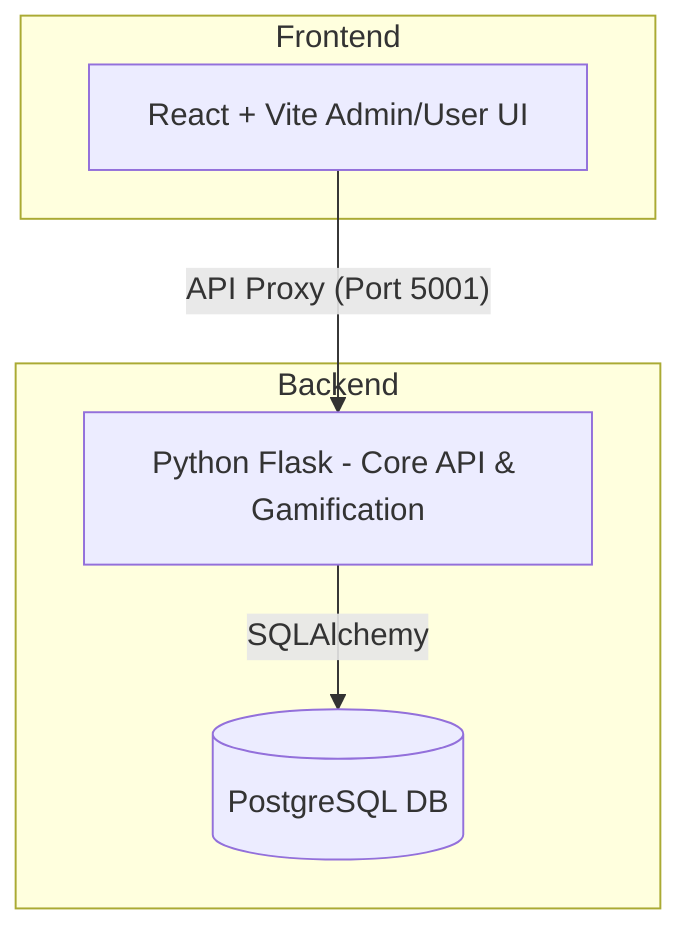

# EnableU - Premium Accessibility-First Learning Platfrom

[](https://opensource.org/licenses/MIT)

**EnableU** is a state-of-the-art, accessible learning platform that combines premium 3D aesthetics with rigorous inclusive design. Built to ensure equal access for all, it features dynamic themes, granular progress tracking, and a robust multi-backend architecture.

## 🌟 Key Features

### 🎮 Premium Experience
- **Interactive 3D UI**: Immersive 3D environments with mouse-parallax, perspective tilt, and glassmorphism.
- **Micro-Animations**: Fluid transitions and interactive elements that respond to user presence.
- **Dynamic Themes**: Context-aware color palettes for different app sections.

### ♿ World-Class Accessibility
- **Dyslexia-Friendly Modes**: Specialized typography and reading guides.
- **High Contrast Support**: AA-compliant visual modes for low vision.
- **Inclusive Navigation**: Fully keyboard-navigable with ARIA-ready screen reader support.
- **Reduced Motion**: Respects system preferences for motion-sensitive users.

### 📚 Gamified Education
- **Real-time Tracking**: Granular progress visualization "while you learn".
- **Dynamic Leaderboard**: Synchronized competitive rankings across user activity.
- **Achievement System**: Badge rewards for curriculum milestones and perfect scores.

---

## 🏗️ Architecture Overview

EnableU utilizes a modern architecture centered around a robust **Python Flask** backend for core services, with a Node.js service available for specialized tasks.

For a deep dive into the system design, please see [ARCHITECTURE.md](ARCHITECTURE.md).



---

## 🚀 Quick Start

### 1. Repository Setup
```bash
git clone <repository-url>
cd enableu
```

### 2. Backend (Python/Flask)
The core application logic resides here.
```bash
cd server_py
pip install -r requirements.txt
# Ensure .env is configured (see server_py/README.md)
python app.py
```
*Runs on: `http://localhost:5001`*

### 3. Frontend (React/Vite)
Modern, accessible UI with 3D effects.
```bash
cd client
npm install
npm run dev
```
*Runs on: `http://localhost:5173`*

> **Note**: The Node.js backend (`server`) is available on port 5000 as a secondary service but is not required for the core application flow.

---

## 📁 Component Deep Dives

For detailed "pin-to-pin" setup and dependency information, please refer to the individual module documentation:

- 🎨 **[Frontend Documentation](client/README.md)** - React, Tailwind 4, 3D Core.
- 🐍 **[Python Backend Documentation](server_py/README.md)** - Flask, SQLAlchemy, Gamification Engine.
- ⬢ **[Node Backend Documentation](server/README.md)** - Express services.

---

## 🔐 Credentials & Security
- **Admin Setup**: Run `python setup_admin.py` in `server_py`.
- **Reference**: See [ADMIN_CREDENTIALS.md](ADMIN_CREDENTIALS.md) for default logins.

## 🤝 Contributing
Contributions that uphold WCAG 2.1 AA standards are always welcome.

---
**Made with ❤️ for accessible education**
